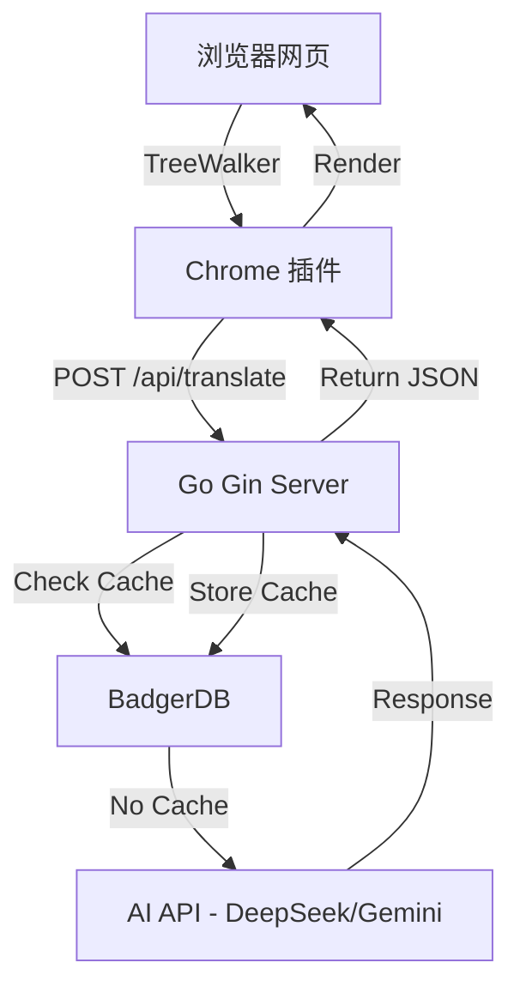

# 技术地图 (System Map) - MyImmersive

## 1. 核心技术栈 (Tech Stack)

### 后端 (Go Backend)

- **框架**: [Gin](https://github.com/gin-gonic/gin) - 高性能 HTTP 框架。
  - 核心职责: 路由分发、JSON 解析、并发控制。
- **热重载**: [Air](https://github.com/cosmtrek/air) - Go 实时重载工具。
- **存储**: [BadgerDB](https://github.com/dgraph-io/badger) - 纯 Go 编写的高性能嵌入式 KV 数据库。
  - 核心职责: 翻译缓存存储 (Key: MD5(URL+Text), Value: TranslatedText)。
- **API 通讯**: 标准库 `net/http` 或 `Resty`。
  - 核心职责: 调用 DeepSeek/Gemini API。

### 前端 (Chrome Extension)

- **版本**: Manifest V3
- **核心组件**:
  - `Content Script`: DOM 扫描 (TreeWalker)、文本提取、翻译回填。
  - `Background Service Worker`: (计划中) 跨域请求中转、配置管理。
- **开发规范**: 原生 JS，不引入重型框架以保证轻量级。

## 2. 系统架构 (Architecture)

## 3. 关键目录结构 (Directory Structure)

- `backend/`: Go 后端源码
  - `main.go`: 程序入口
  - `internal/`: 内部逻辑 (Handler, Cache, API)
- `extension/`: 插件源码
  - `manifest.json`: 插件配置
  - `scripts/`: JS 逻辑
- `.context/`: ACMP 协议上下文 (真理来源)
  - `active_task.md`: 当前任务
  - `system_map.md`: 本文件

## 4. 技术决策记录 (ADR)

- **缓存策略**: 采用 `URL + Content` 的 MD5 作为 Key，确保相同内容在不同页面或同一页面的重复触发能被缓存。
- **并发控制**: 后端使用信号量限制对 AI API 的并发调用，防止触发 429 限流。
- **安全隔离**: 前端直接注入样式到页面，但使用特定的前缀 (如 `my-trans-`) 防止与原站 CSS 冲突。
