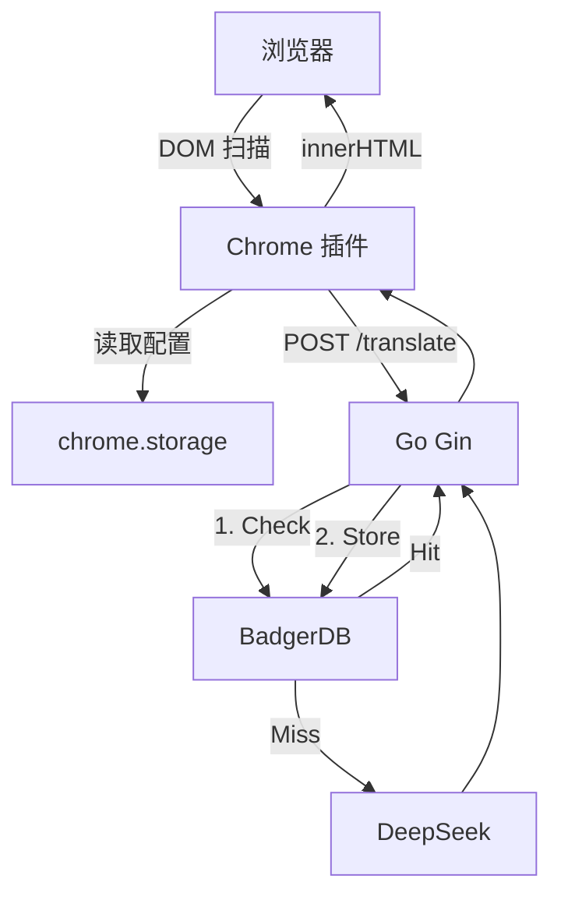

# 技术地图 (System Map) - MyImmersive

## 1. 核心技术栈 (Tech Stack)

### 后端 (Go Backend)

| 组件     | 技术        | 说明           |
| -------- | ----------- | -------------- |
| Web 框架 | Gin         | 高性能 HTTP    |
| 热重载   | Air         | 开发时实时重载 |
| 配置     | godotenv    | .env 环境变量  |
| 缓存     | BadgerDB v4 | 嵌入式 KV      |
| AI API   | go-openai   | DeepSeek 兼容  |

### 前端 (Chrome Extension)

| 组件     | 技术                | 说明       |
| -------- | ------------------- | ---------- |
| Manifest | V3                  | 最新规范   |
| 存储     | chrome.storage.sync | 跨设备同步 |
| 样式     | 原生 CSS            | 暗色主题   |

## 2. 系统架构



## 3. 目录结构

```
backend/
├── main.go
├── config/config.go
├── data/cache/             # BadgerDB (gitignore)
└── internal/
    ├── cache/cache.go
    ├── handler/translate.go
    ├── service/translator.go
    └── middleware/cors.go

extension/
├── manifest.json
├── content.js
├── popup.html/js/css       # 设置页面
├── background.js
└── styles/content.css
```

## 4. 技术决策 (ADR)

| 决策     | 选择                | 原因                  |
| -------- | ------------------- | --------------------- |
| 缓存 Key | MD5(text)           | 内容哈希，跨页复用    |
| 占位符   | `{{0}}`             | 保留 code/strong 样式 |
| 设置存储 | chrome.storage.sync | 跨设备同步            |
| Prompt   | 6 规则+示例         | 提升翻译质量          |
