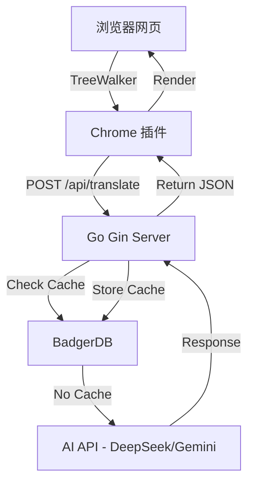

# 技术地图 (System Map) - MyImmersive

## 1. 核心技术栈 (Tech Stack)

### 后端 (Go Backend)

- **框架**: [Gin](https://github.com/gin-gonic/gin) - 高性能 HTTP 框架。
- **热重载**: [Air](https://github.com/cosmtrek/air) - Go 实时重载工具。
- **配置管理**: [godotenv](https://github.com/joho/godotenv) - 环境变量管理。
- **存储**: [BadgerDB](https://github.com/dgraph-io/badger) - 纯 Go 编写的高性能嵌入式 KV 数据库 (待集成)。
- **API 通讯**: [go-openai](https://github.com/sashabaranov/go-openai) - OpenAI/DeepSeek 兼容客户端。

### 前端 (Chrome Extension)

- **版本**: Manifest V3
- **核心组件**:
  - `Content Script`: DOM 扫描 (TreeWalker)、文本提取、翻译回填。
  - `Background Service Worker`: (计划中) 跨域请求中转、配置管理。
- **开发规范**: 原生 JS，不引入重型框架以保证轻量级。

## 2. 系统架构 (Architecture)



## 3. 目录结构 (Directory Structure)

```
backend/
├── main.go                 # 程序入口 (~30行)
├── .env                    # 本地配置 (不提交)
├── .env.example            # 配置模板
├── config/
│   └── config.go           # 配置管理 (环境变量)
└── internal/
    ├── handler/
    │   └── translate.go    # HTTP 处理器
    ├── service/
    │   └── translator.go   # 翻译业务逻辑
    └── middleware/
        └── cors.go         # CORS 中间件

extension/
├── manifest.json           # 插件配置
├── content.js              # 内容脚本 (~140行)
├── background.js           # Service Worker
└── styles/
    └── content.css         # 翻译样式

.context/
├── active_task.md          # 当前任务 (ACMP)
└── system_map.md           # 本文件
```

## 4. 技术决策记录 (ADR)

- **配置管理**: 使用 `.env` 文件 + `godotenv` 加载环境变量，敏感信息不硬编码。
- **模块化**: 后端采用三层架构 (Handler -> Service -> Config)，职责分离。
- **样式分离**: 插件样式通过 `manifest.json` 的 `css` 字段注入，与 JS 逻辑解耦。
- **缓存策略**: (待实现) 采用 `URL + Content` 的 MD5 作为 Key。
- **并发控制**: 后端使用信号量限制对 AI API 的并发调用。
- **安全隔离**: 前端使用特定前缀 (如 `my-trans-`) 防止与原站 CSS 冲突。
