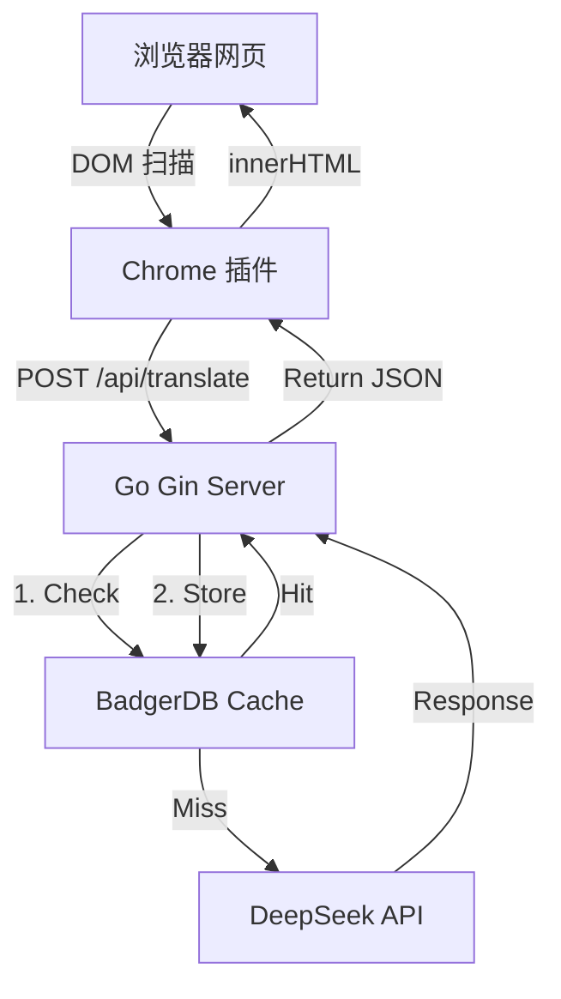

# 技术地图 (System Map) - MyImmersive

## 1. 核心技术栈 (Tech Stack)

### 后端 (Go Backend)

- **框架**: [Gin](https://github.com/gin-gonic/gin) - 高性能 HTTP 框架
- **热重载**: [Air](https://github.com/cosmtrek/air) - Go 实时重载工具
- **配置管理**: [godotenv](https://github.com/joho/godotenv) - 环境变量管理
- **缓存**: [BadgerDB v4](https://github.com/dgraph-io/badger) - 嵌入式 KV 数据库 ✅
- **API 通讯**: [go-openai](https://github.com/sashabaranov/go-openai) - OpenAI/DeepSeek 兼容客户端

### 前端 (Chrome Extension)

- **版本**: Manifest V3
- **核心组件**:
  - `Content Script`: DOM 扫描、占位符处理、翻译回填
  - `Background Service Worker`: (计划中) 跨域请求中转
- **开发规范**: 原生 JS，不引入重型框架

## 2. 系统架构 (Architecture)



## 3. 目录结构 (Directory Structure)

```
backend/
├── main.go                 # 程序入口
├── .env                    # 本地配置 (不提交)
├── data/cache/             # BadgerDB 数据 (不提交)
├── config/
│   └── config.go           # 配置管理
└── internal/
    ├── cache/
    │   └── cache.go        # BadgerDB 封装
    ├── handler/
    │   └── translate.go    # HTTP 处理器
    ├── service/
    │   └── translator.go   # 翻译业务逻辑 (含缓存)
    └── middleware/
        └── cors.go         # CORS 中间件

extension/
├── manifest.json
├── content.js              # 内容脚本 (占位符逻辑)
├── background.js
└── styles/content.css
```

## 4. 技术决策记录 (ADR)

| 决策项   | 选择      | 原因                        |
| -------- | --------- | --------------------------- |
| 缓存方案 | BadgerDB  | 嵌入式、无需部署、纯 Go     |
| 缓存 Key | MD5(text) | 同内容同 Key，跨页面复用    |
| 占位符   | `{{0}}`   | 保留 code/strong 等标签样式 |
| 配置管理 | .env      | 安全、灵活、本地不提交      |
